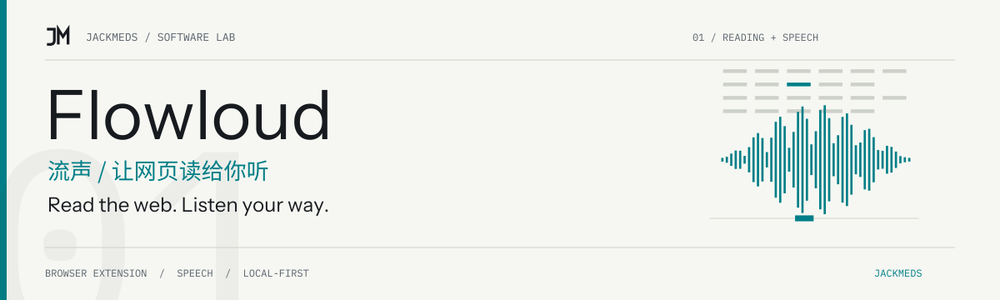
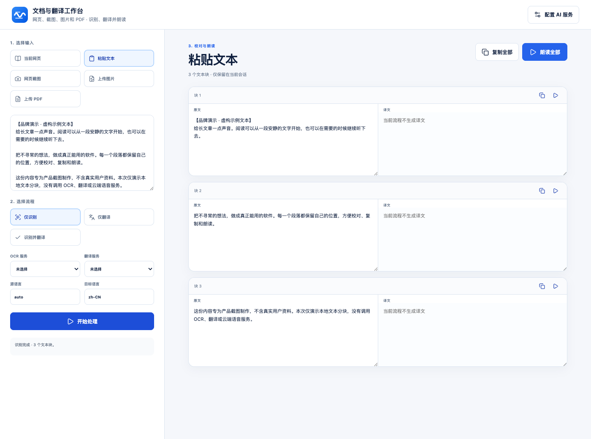

<!-- jackmeds-brand:start -->
<picture>
  <source media="(prefers-color-scheme: dark)" srcset="assets/brand/hero-dark.svg">
  
</picture>
<!-- jackmeds-brand:end -->

# Flowloud / 流声

把长网页听进去，也随时找回正在读的那一句。

Flowloud 是面向 Edge 与 Chrome 的网页朗读、OCR 与翻译扩展。打开文章或论坛帖子，用系统语音开始听读；需要更多声音时，再选择浏览器模型、本地服务或自己的云 API。

[快速开始](#快速开始) · [安装与 Alpha 分发](docs/install.md) · [完整使用参考](docs/usage-reference.zh-CN.md) · [English](README.en.md)

## 看看流声



图中是在真实扩展工作台中粘贴的虚构示例文本，实际完成了本地识别与分块。截图没有执行在线 OCR、翻译或语音生成。[截图来源与复现](docs/brand-proof.md)。

网页听读时，当前句、工具栏控制与正文定位属于同一个过程。关闭弹窗后朗读会继续；关闭来源标签页则停止该页任务。

## 能做什么

- **听文章，也听对话。** 提取普通正文及 Discourse、Flarum、NodeBB 等论坛内容，为楼主、旁白和回复作者分配不同音色。
- **听到哪里，看到哪里。** 当前句与逐词高亮、上一句／下一句、回到正文位置；手动滚动时不强行抢回位置。
- **选择声音的运行位置。** 默认系统语音；按需使用 Kokoro 浏览器模型、回环地址上的本地服务、OpenAI 兼容 TTS 或豆包 TTS。
- **把资料带进工作台。** 读取网页、粘贴文本、图片和选定 PDF 页面；数字 PDF 本地提取文字，OCR 与翻译使用你选定的 Profile。
- **保留页面本来的操作。** 轻量语义导览按标题、段落等区域导航，支持键盘、减少动效与高对比度；不代替用户点击或提交表单。

## 快速开始

当前为 `0.10.0-alpha.1`。商店分发仍面向受控测试者，详情见[安装说明](docs/install.md)。下面是从源码加载的方式，默认语音不需要 API Key、本地网关或模型下载。

### 1. 下载并加载扩展

```bash
git clone https://github.com/JackMeds/flowloud.git
cd flowloud
```

在 Edge 打开 `edge://extensions/`，或在 Chrome 打开 `chrome://extensions/`，启用“开发人员模式”，选择“加载解压缩的扩展”，加载仓库中的 **`extension/`** 目录。这是当前完整运行时与发布源。

Windows 用户也可在 PowerShell 中运行 `.\package-extension.ps1`，再加载输出的 `dist\Flowloud-Edge`。不要将 `extension-wxt/` 当作完整扩展加载。

### 2. 听第一篇文章

1. 刷新已经打开的文章或论坛页面。
2. 点击工具栏中的 Flowloud 图标，等待显示已识别段落。
3. 保持默认系统语音，点击“开始朗读”。
4. 使用上一句／下一句定位，或按 `Alt+O` 播放、暂停。

开启“显示网页悬浮球”后，也能从网页边缘打开播放控制。本页音色分配从弹窗进入；模型、API 与全局偏好在设置中心配置。

## 隐私与限制

正文默认在设备上解析；打开网页不会自动播放或下载模型。选择在线 TTS 后，待朗读文本才会发送到你授权的 HTTPS 服务。图片、截图或扫描 PDF 的 OCR 需要配置支持视觉的服务，并确认此次上传；翻译只发送对应文本块。凭据默认保存在浏览器会话中，可单独选择在本机记住。

主要验证环境为 Windows 与 Edge；Chrome 也有独立打包与测试流程。浏览器内部页面、扩展商店及受限制页面无法注入。Kokoro 使用预设音色、不提供克隆；扩展不内置 OCR 权重。页面导览是听读辅助，不能替代系统读屏工具。

[隐私政策](docs/privacy.md) · [数据删除](docs/data-deletion.md) · [Provider 数据流与能力](docs/providers.md)

## 开发与文档

完整 Provider、音色、网关命令、流式协议及目录说明已整理到[使用与开发参考](docs/usage-reference.zh-CN.md)。

- [前端迁移边界](docs/frontend-migration.md)：`extension/` 为完整运行时，`extension-wxt/` 负责 React 界面及开发工具。
- [真实网站自动测试](docs/automated-browser-testing.md)：使用隔离的 Playwright Chromium 进行提取与播放验证。
- [添加 Provider](docs/adding-provider.md) · [版本说明](docs/release-notes-0.10.0-alpha.1.md) · [支持](docs/support.md)

界面开发需要 Node.js 22+ 和 pnpm：

```bash
cd extension-wxt
pnpm install
pnpm storybook
```

Storybook 用于独立预览界面状态；完整扩展调试请按[浏览器测试文档](docs/automated-browser-testing.md)操作。

扩展许可证见 [MIT License](extension/LICENSE)。Mozilla Readability、图标等第三方资源保留各自许可，见 [THIRD_PARTY_NOTICES.md](THIRD_PARTY_NOTICES.md) 与 [Readability 许可证](extension/vendor/readability/LICENSE.md)。
