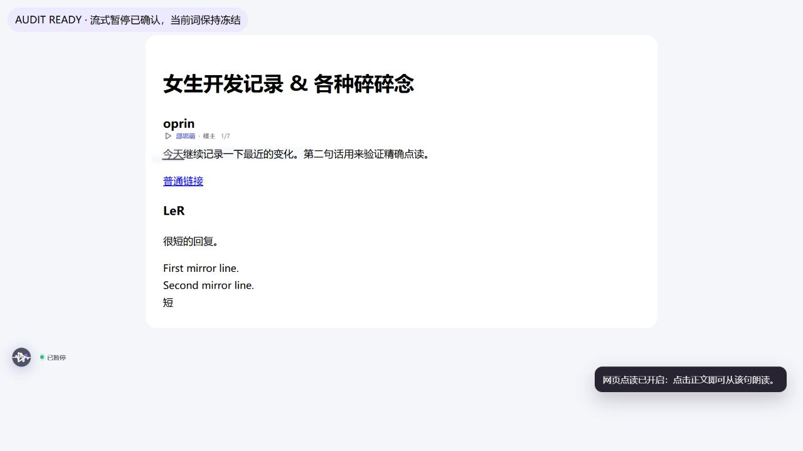
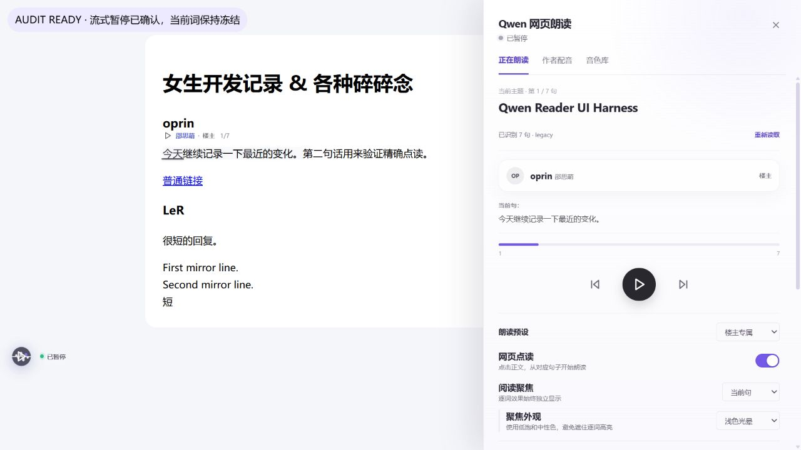
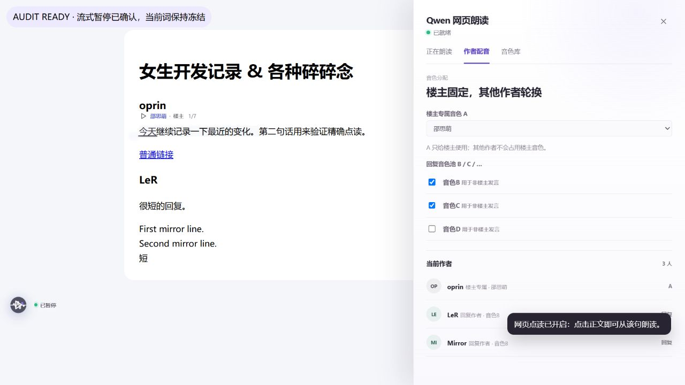
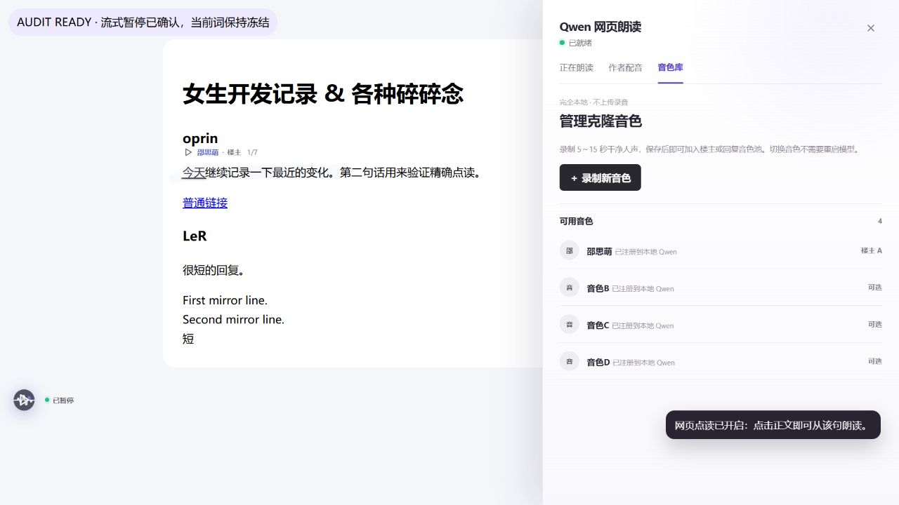
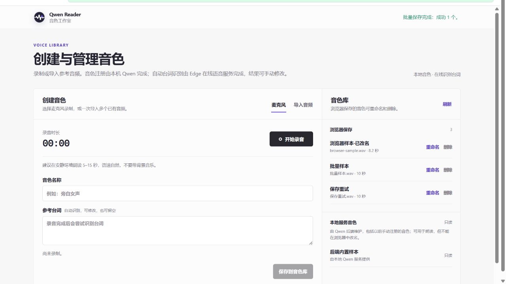

# Qwen 网页朗读：界面架构与设置策略研究报告

日期：2026-08-17  
审计对象：当前工作区中的 Qwen 网页朗读 v0.5.2 界面  
目标：让入口、播放控制、页面内设置和全局设置更符合浏览器用户的既有习惯

## 一、结论先行

建议采用“入口层—会话层—管理层”的三层架构：

1. **入口层**只负责让用户找到并打开朗读，不承担复杂播放逻辑。
2. **会话层**只服务当前网页、当前朗读和当前作者分配，持续可见但足够轻。
3. **管理层**放全局默认值、视觉偏好、音色创建/导入/删除、隐私与连接等低频复杂任务，使用独立完整设置页。

因此，不建议把所有设置都塞进侧栏，也不建议为了“简单”删掉已有能力。应当简化的是**默认暴露的复杂度**：高频、当前页面相关的控制就近出现；低频、全局、风险较高或需要大空间的任务进入设置中心。

当前 `options_page` 已经指向音色工作室，方向是对的。更合理的下一步不是再新建一个互不相关的设置页面，而是把音色工作室升级成统一“设置中心”的一个栏目。

推荐优先落地方案 A；如果近期不想引入原生 Side Panel API，可先用方案 B 完成信息架构重排，再迁移。

## 二、判断设置应该放在哪里的方法论

每个功能先回答四个问题：

| 维度 | 要问的问题 | 倾向放置位置 |
| --- | --- | --- |
| 使用频率 | 每次播放都会用，还是一个月只改一次？ | 高频靠近播放器；低频进设置页 |
| 作用范围 | 只影响当前网页/本次播放，还是影响所有网页？ | 当前上下文进侧栏；全局默认进设置页 |
| 中断成本 | 调整时能否离开当前网页？ | 不能中断的留在侧栏；可暂停处理的进独立页 |
| 复杂度与风险 | 是否包含录音、批量导入、删除、隐私说明或故障诊断？ | 复杂或高风险任务使用完整页面 |

由此可得到清晰的分配规则：

| 表面 | 用户心智 | 应该包含 | 不应该包含 |
| --- | --- | --- | --- |
| 浏览器工具栏/页面入口 | “我要开始用这个扩展” | 打开侧栏、读取选中文本、状态徽标、快捷键提示 | 大量设置、动态改变主语义的按钮 |
| 朗读侧栏/迷你播放器 | “我正在听这一页” | 播放/暂停、前后句、速度、进度、当前句、队列、本页作者分配 | 录音、批量导入、全局视觉细节、删除音色 |
| 完整设置页 | “我在配置这个扩展” | 默认音色与速度、点读默认值、高亮与聚焦、音色库、快捷键、隐私、服务状态 | 当前句、当前队列、只对本页生效的临时状态 |

这个方法的核心是**作用域一致**：同一个设置不要在多个位置以完全相同的方式重复出现。若同时提供“当前页覆盖”和“全局默认”，必须明确写出作用范围，例如“仅此网页”与“设为默认”。

## 三、当前体验审计

### 审计范围

主流程为：发现入口 → 打开侧栏 → 控制朗读 → 配置作者音色 → 查看音色库 → 进入音色工作室。

截图来自本次审计运行中的真实 UI harness；没有使用历史截图作为审计证据。

### 步骤 1：收起状态与悬浮入口

健康度：**中等，有辨识度，但语义不稳定。**

优点：

- 44×44 像素的悬浮标志足够醒目，也支持拖动和边缘吸附。
- 状态点让“已就绪/播放中/错误”有持续反馈。
- 页面点读的即时提示能解释状态变化。

问题：

- 同一个悬浮标志在待机时负责打开面板，播放中又变成播放/暂停，主语义会随状态切换。用户无法形成稳定肌肉记忆。
- 标志和旁边的状态文字是两个可点击对象，视觉上却像一个整体；状态文字字号约 10px，点击意图不清晰。
- 在所有页面长期显示悬浮入口，会和站点自带聊天按钮、回到顶部按钮、无障碍工具冲突。
- “已就绪”是系统状态，不是用户任务。入口更应表达“朗读本页”或“打开朗读”。

建议：

- 悬浮入口的点击行为始终固定为“打开/收起朗读面板”。
- 播放开始后另显示紧凑的播放控件，避免把打开面板和播放暂停叠在同一命令上。
- 默认只在识别出可朗读正文时出现；提供“自动显示 / 仅播放时显示 / 永不显示”全局选项。
- 站点冲突时允许左右边切换并记忆域名级位置。

### 步骤 2：正在朗读侧栏

健康度：**功能完整，但首屏任务过载。**

优点：

- 当前标题、作者、句子、进度和前后句控制形成了完整播放上下文。
- 自动扫描但不自动发声，符合“系统先准备、用户再确认”的安全预期。
- 服务状态、错误状态、进度和暂停均有清晰反馈。

问题：

- 首屏同时承载页面识别、播放器、朗读预设、网页点读、阅读聚焦、聚焦外观、逐词样式和队列。用户打开侧栏时很难判断首先该做什么。
- 最重要的播放控制会随着侧栏滚动离开视野；长队列与更多设置会进一步拉长页面。
- 常用的“速度”没有出现在播放器核心区域，而视觉高亮的细节却占据首屏。
- 标签写“正在朗读”，暂停时仍显示该名称，建议改为更中性的“播放”。
- 侧栏在 1280px 视口约占四成宽度。对于“伴随阅读”的工具，正文被遮挡/压缩较明显。
- “重新读取”和适配器信息更偏技术诊断，不应与主播放动作竞争注意力。

建议布局：

1. 顶部固定：页面标题、服务状态、设置入口。
2. 中部滚动：当前句和队列。
3. 底部固定播放器：上一句、播放/暂停、下一句、速度、进度。
4. “本页选项”折叠区：作者分配、点读、当前页聚焦开关。
5. “外观与默认值”跳转到设置页，不在侧栏展开颜色、光晕、扫光速度等细节。

### 步骤 3：作者配音

健康度：**适合保留在侧栏，但需要更明确地表达“仅当前页”。**

优点：

- “楼主固定、其他作者轮换”与论坛阅读场景高度相关，属于当前页面上下文。
- 作者列表能直接验证分配结果，反馈闭环完整。

问题：

- “楼主 A / 回复 B、C”偏实现模型，对初次用户不够自然。
- 当前是全局默认音色与当前页作者映射混合呈现，作用范围容易误解。
- 作者卡片与音色选择之间缺少直接的“此作者使用什么音色”的可编辑联系。

建议：

- 标签改为“本页配音”或只在识别到多作者内容时出现。
- 默认先给出一句自然语言摘要：“楼主使用邵思萌，3 位回复作者轮换 2 个音色”。
- 提供“仅本页覆盖”与“设为以后默认”两个明确动作；默认只修改当前页。
- 高级模式再显示 A/B/C 编组概念。

### 步骤 4：侧栏音色库

健康度：**与完整音色工作室重复，定位模糊。**

优点：

- 可快速看到可用音色和当前楼主音色。
- “录制新音色”入口能通向完整工作室。

问题：

- 标签名叫“音色库”，但这里不能重命名、删除、批量导入或查看详细来源，实际更像“音色选择器 + 设置页入口”。
- 与独立音色工作室形成两个心智相近但能力不一致的页面。
- 列表主要展示状态，当前播放任务中价值有限。

建议：

- 从顶层标签移除“音色库”。
- 当前页需要换音色时，在播放器或“本页配音”中直接提供带试听的选择器。
- 全局管理统一进入“设置 → 音色库”。

### 步骤 5：独立音色工作室

健康度：**容器选择正确，是最适合继续扩展为设置中心的基础。**

优点：

- 录音、导入、参考台词、重命名、删除、只读音色等复杂任务得到足够空间。
- 左侧创建、右侧管理的工作区结构清楚；批量导入也有合理扩展空间。
- “本地音色 / 在线识别台词”有隐私范围提示。

问题：

- 它目前只叫“音色工作室”，没有承担扩展其他全局设置，导致设置入口仍然分散。
- 录音和导入与音色列表长期并排，窄屏时信息密度高。
- 在线台词识别、数据发送范围、保存位置和删除影响还可以更明确。

建议：

- 将其改成统一设置中心，左侧导航为：通用、朗读、外观、音色库、快捷键、隐私与连接。
- 音色库保留现有工作区，但把“创建音色”做成主内容，“音色列表”可在窄屏切成独立子页。
- 删除前显示受影响的默认方案，并提供自动修复后的结果预览。

## 四、可访问性观察

已确认的优点：

- 代码中使用了 `tablist/tab`、`role="switch"`、`aria-live`、明确按钮标签和 `:focus-visible`。
- 已提供 `prefers-reduced-motion` 降级。
- 悬浮入口为 44×44，达到更严格的推荐触控尺寸。

主要风险：

- 多处辅助文字只有 9–10px，颜色也偏淡；在高 DPI、缩放或低视力场景下阅读负担较高。
- 侧栏关闭按钮为 32×32，达到 WCAG 2.2 AA 的 24×24 最小目标，但不满足更宽松易点的 44×44 推荐目标。
- 7px 宽的拖拽调整条缺少显式键盘替代；需要提供预设宽度或键盘可调方式。
- 当前视觉证据无法证明对比度、完整键盘顺序、屏幕阅读器朗读、200%/400% 缩放和浏览器高对比模式是否全部通过。

## 五、外部调研带来的设计约束

浏览器平台已经把不同任务对应到不同 UI 表面：

- Chrome 将 action、popup、side panel 和 options page 作为独立组件；side panel 用于伴随网页的功能，options page 用于扩展定制。  
  来源：[Chrome UI components](https://developer.chrome.com/docs/extensions/develop/ui)、[Chrome Side Panel API](https://developer.chrome.com/docs/extensions/reference/api/sidePanel)、[Chrome options page](https://developer.chrome.com/docs/extensions/develop/ui/options-page)
- Chrome 和 Edge 的 Side Panel API 都支持由工具栏图标、快捷键或用户手势打开，并可保持伴随网页。  
  来源：[Microsoft Edge sidebar extensions](https://learn.microsoft.com/en-us/microsoft-edge/extensions/developer-guide/sidebar)
- Edge 自带 Read Aloud 同时提供地址栏、右键菜单、更多菜单、PDF 工具栏和沉浸式阅读器入口，说明“多入口、同一任务”符合朗读功能习惯。  
  来源：[Microsoft Edge ReadAloudEnabled](https://learn.microsoft.com/en-us/deployedge/microsoft-edge-policies/readaloudenabled)
- Chrome Android 的 Listen to this page 把播放、前后跳转和速度放在播放器，把音色与高亮放在二级 Options，体现了“会话控制在前、偏好设置在后”的层级。  
  来源：[Google Chrome Listen to this page](https://support.google.com/chrome/answer/14768725)
- Chrome Web Store 中拥有约 400 万用户的 Read Aloud 也采用快速播放界面加独立 Options 页，音色、速度、音高和高亮属于设置。它证明独立设置页是用户已经熟悉的扩展模式，但其“停止播放后才看到齿轮”的限制不应照搬。  
  来源：[Read Aloud: A Text to Speech Voice Reader](https://chromewebstore.google.com/detail/read-aloud-a-text-to-spee/hdhinadidafjejdhmfkjgnolgimiaplp)
- WCAG 2.2 AA 要求指针目标至少 24×24 CSS 像素或具有足够间距；重要控制建议向 44×44 靠拢。  
  来源：[W3C Target Size Minimum](https://www.w3.org/WAI/WCAG22/Understanding/target-size-minimum)、[W3C Target Size Enhanced](https://www.w3.org/WAI/WCAG22/Understanding/target-size-enhanced)

调研不意味着必须完全改用浏览器原生侧栏，但说明用户对“工具栏入口—伴随侧栏—设置页”已有稳定预期。自定义 UI 若偏离这套心智，应有明确收益。

## 六、三个具体方案

### 方案 A：原生侧栏 + 统一设置中心（推荐）

结构：

- 工具栏图标、Alt+O、右键“朗读选中文本”作为入口。
- 只在识别出可朗读正文时显示可选的页面悬浮入口，点击始终打开原生侧栏。
- 原生 Side Panel 承载播放、队列和本页配音。
- 完整 options page 承载通用、朗读、外观、音色库、快捷键、隐私与连接。

优点：最符合浏览器习惯；不再用最高 `z-index` 覆盖网页；侧栏生命周期和位置由浏览器管理；设置架构可持续扩展。

代价：需要把当前 Shadow DOM 侧栏迁移为扩展页，并重新设计 content script 与 side panel 的状态同步。Edge 切换标签时还需针对官方已知行为做兼容测试。

适用：希望把项目做成长期维护、功能会继续增长的产品。

### 方案 B：保留自定义侧栏，但重排层级（近期可落地）

结构：

- 保留现有悬浮入口和 Shadow DOM 侧栏。
- 悬浮入口只负责开关侧栏；播放时出现独立迷你控制条。
- 侧栏改为“播放 / 本页配音”两层，移除顶层“音色库”。
- 播放器固定在底部；视觉细节和全局默认移入设置中心。
- 将现有音色工作室扩成完整设置页。

优点：开发成本较低；现有测试和页面高亮能力可复用；能较快解决首屏过载和功能重复。

代价：仍然可能与网页固定元素冲突；自定义侧栏的宽度、响应式和可访问性都要自行维护。

适用：先验证新信息架构，控制一次重构范围。

### 方案 C：迷你播放器优先，不保留完整侧栏

结构：

- 工具栏图标开始朗读。
- 播放后在页面底部/边缘出现紧凑播放器：上一句、播放/暂停、下一句、速度和关闭。
- 当前句通过页面高亮呈现；队列、作者映射和所有设置进入完整页面。

优点：最轻、最少遮挡网页，适合只想“一键朗读”的用户。

代价：论坛多作者配音、长队列跳转和故障状态缺少合适空间；频繁打开设置页会中断当前任务。

适用：如果产品最终决定以大众单人朗读为主，而不是多作者论坛配音。

### 方案比较

| 方案 | 符合用户习惯 | 当前功能承载力 | 实施成本 | 长期扩展性 | 建议 |
| --- | --- | --- | --- | --- | --- |
| A 原生侧栏 + 设置中心 | 高 | 高 | 中高 | 高 | 最终目标 |
| B 自定义侧栏重排 | 中高 | 高 | 中 | 中 | 最适合近期第一步 |
| C 迷你播放器 | 高 | 中低 | 中 | 中低 | 仅在产品主动简化定位时选择 |

## 七、推荐的信息架构

### 入口层

- 工具栏图标：打开/收起朗读侧栏。
- Alt+O：同一行为，不再承担另一套逻辑。
- 右键选中文本：从选中内容开始朗读。
- 页面悬浮入口：默认“只在检测到可朗读内容时显示”；可在设置中关闭。
- 工具栏 badge：只表示“播放中/错误”等状态，不用长文字。

### 会话层：播放侧栏

- 顶部：页面标题、服务状态、齿轮设置入口。
- 固定播放器：上一句、播放/暂停、下一句、速度、进度。
- 当前内容：当前作者、当前句、队列。
- 条件化“本页配音”：仅多作者页面显示。
- 折叠“本页选项”：点读、跟随、当前页聚焦。

### 管理层：设置中心

- 通用：入口显示规则、自动扫描、默认行为。
- 朗读：默认速度、音量、默认音色、自动连读。
- 外观：句子聚焦、逐词样式、颜色、光晕、扫光速度、减少动效。
- 音色库：录音、导入、试听、重命名、删除、来源与只读状态。
- 快捷键：显示当前快捷键并跳转到浏览器快捷键管理。
- 隐私与连接：本机端口状态、哪些数据留在本机、何时使用在线台词识别、故障诊断。

## 八、设计语言建议

建议延续当前“低饱和编辑器 + 紫色强调”的方向，但建立更严格的规则：

- 紫色只用于选中、进度和链接；绿色只表示成功/就绪，黄色表示等待，红色表示错误。
- 核心操作文字不小于 12px，正文说明优先 12–13px；9–10px 只用于非关键元数据。
- 间距使用 4px 基础栅格，常用级别为 8/12/16/24。
- 圆角收敛到 6/8/12 三档；避免一处 14px 卡片、另一处完全无容器但层级相同。
- 所有图标按钮至少 32×32，播放和关闭等重要控制优先 44×44。
- 保持已有 160–220ms 轻动效和 reduced-motion 降级，不增加无任务意义的发光动画。
- 页面内高亮和插件 UI 使用同一语义色，但不要都抢夺高对比度；播放控件优先，阅读高亮其次，装饰最后。

## 九、实施顺序

### 第 1 阶段：先改结构，不改底层能力

1. 将悬浮入口点击语义固定为开关侧栏。
2. 固定播放控制，加入速度入口。
3. 把视觉样式设置移出侧栏。
4. 将“作者配音”改为“本页配音”，只在多作者页面出现。
5. 移除顶层“音色库”，改为设置跳转。
6. 将音色工作室套入统一设置中心壳层。

### 第 2 阶段：验证原生 Side Panel

1. 建立共享播放状态模型，让 content script 只负责提取、高亮和点读。
2. 用原生 side panel 复刻精简后的侧栏信息架构。
3. 对比自定义侧栏与原生侧栏在多标签、窄窗口、受限页面和浏览器缩放下的表现。

### 第 3 阶段：用户验证

用 5–8 名目标用户完成五个任务：

1. 找到入口并开始朗读。
2. 暂停后调整速度并继续。
3. 让楼主和回复使用不同音色。
4. 开启网页点读并理解其作用范围。
5. 创建一个新音色并设为默认。

记录任务成功率、完成时间、误点次数、需要解释的次数和单题易用度评分。建议的验收线：

- 新用户不看说明即可在 20 秒内开始朗读。
- 播放中一眼可找到暂停、速度和停止。
- 80% 以上用户能正确说出“本页设置”和“全局默认”的区别。
- 重要控件至少满足 24×24，核心播放控件达到 44×44。
- 320px 宽侧栏、200% 缩放和键盘操作下仍能完成核心流程。

## 十、最终建议

产品方向应定为：**保留功能深度，减少默认暴露；让当前任务留在侧栏，让长期配置回到设置中心。**

近期选择方案 B 改完信息架构，并把它当作方案 A 的过渡版本；中期迁移到原生 Side Panel。不要继续在当前“正在朗读”首屏叠加设置项，也不要再增加第三个独立配置入口。

## 十一、证据限制

- 截图来自当前代码的本地真实 UI harness，使用固定论坛内容和模拟服务状态；它能支持视觉与流程判断，但不等于真实用户环境中的完整扩展审计。
- 音色工作室截图使用成功的模拟音色数据；未进行真实麦克风授权、真实文件导入或真实后端注册。
- 尚未验证屏幕阅读器、完整键盘顺序、精确颜色对比度、浏览器高对比模式和多个真实网站上的固定元素冲突。
- 当前主工作区存在未提交改动；本报告存放在独立 worktree，截图审计的是主工作区当前 v0.5.2 界面快照，而不是基线提交中的旧界面。

